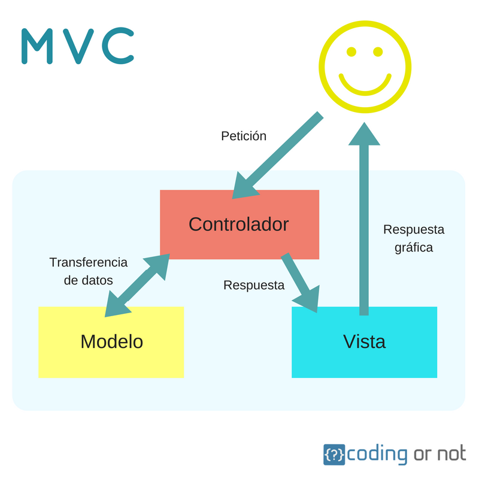

# Sesión 1 – EMS

---

## Modelo Entidad-Relación de la Base de Datos

### Diseño lógico

### Observaciones a la BBDD

| **Entidad**      | **Rol en negocio**                                                                                     | **Observaciones**                                                                                                                                                                                                                                                                      |
| ---------------- | ------------------------------------------------------------------------------------------------------ | -------------------------------------------------------------------------------------------------------------------------------------------------------------------------------------------------------------------------------------------------------------------------------------- |
| **Alumno**       | Personas que están matriculadas en la universidad y tienen asociadas evaluaciones de ciertas materias. | `n_mat` no es clave primaria (aceptable), pero debería ser clave (único). En la definición de la tabla no se especifica que `n_mat` sea `unique`.                                                                                                                                    |
| **Convocatoria** | Tipo de convocatoria, con 2 tipos: Ordinaria y Extraordinaria.                                        | Existe un atributo `actual` que indica el tipo de convocatoria en curso. No es habitual usar números (bit) para respuestas binarias (sí o no).                                                                                                                                       |
| **Curso**        | Periodo académico.                                                                                     | Problemas similares a `Convocatoria`: el atributo `actual` se maneja de forma numérica en lugar de respuesta sí/no.                                                                                                                                                                    |
| **Evaluación**   | Almacenamiento de las notas de los alumnos.                                                          | La relación resulta muy grande, lo que puede implicar una complejidad innecesaria o el uso de antipatrones. Además, los atributos `practica_convalidada` y `examen_convalidado` deberían utilizar respuestas `True`/`False` en lugar de números.                              |
| **Examen**       | Exámenes realizados a lo largo del curso.                                                            | Sin observaciones.                                                                                                                                                                                                                                                                     |
| **Grupo_clase**  | Grupos de clase en los que se matriculan los alumnos.                                                | Sin observaciones.                                                                                                                                                                                                                                                                     |
| **Grupo_practica** | Grupos de prácticas para realizar las actividades prácticas.                                        | Se observa el mismo error que en `convocatoria` en el atributo `activo`: se usan números para respuestas sí/no.                                                                                                                                                                         |
| **Imparte**      | Relación derivada de la relación N:M entre grupo_clase, profesor y curso.                              | No se aprecian atributos adicionales, salvo las claves foráneas.                                                                                                                                                                                                                        |
| **Matricula**    | Relación derivada de la relación N:M entre alumno, grupo_clase y curso.                                | Se debe analizar si es posible reducir la complejidad de la relación ternaria.                                                                                                                                                                                                          |
| **Práctica**     | Prácticas del curso (actualmente se cuenta con un único registro).                                    | Sin observaciones.                                                                                                                                                                                                                                                                     |
| **Profesor**     | Profesores del curso que califican las actividades de los alumnos.                                   | El atributo `activo` debería responder a sí o no, en lugar de utilizar un número (bit).                                                                                                                                                                                                 |
| **Tipo_evaluacion** | Tipos de evaluaciones existentes y sus respectivos pesos (actualmente con 2 registros).                | El campo `Ev_Continua` sufre el mismo error de utilizar un número para responder sí/no. Analizar si los pesos pueden optimizar el uso de memoria.                                                                                                                                      |
| **Tutoria**      | Sesiones diseñadas para atender dudas (a un nivel muy general).                                        | Se observa una relación cuaternaria que, en ocasiones, podría sustituirse por relaciones binarias o ternarias. Se requiere un análisis detallado.                                                                                                                                      |
| **Nota_final**   | Atributo derivado de la entidad Evaluación, que representa la nota final a partir de otras actividades. |                                                                                                                                                                                                                                                                                        |

---

## Arquitectura de la Aplicación

**¿En qué paquetes se organiza el código?**

- **Capa de datos (Controladores)**
- **Capa de interfaz (Vistas)**
- **Capa lógica de negocio (Modelos)**

La arquitectura está basada en el **Modelo-Vista-Controlador (MVC)**.

**¿Cómo se comunican?**

---

# Diagrama de clases

# Diagrama de secuencia

_Diagramas generados por IntelliJ._

---

## Especificación de Requisitos Funcionales

- **Acceso multiplataforma:**  
  El sistema debe permitir el acceso desde ordenadores y dispositivos móviles con Android e iOS.

- **Consulta de información académica:**  
  El sistema debe permitir a los profesores consultar, en cualquier momento, la información académica de los alumnos a quienes imparten clase.

- **Gestión de asignaturas por parte del profesorado:**  
  Los profesores deben poder gestionar los datos académicos de las asignaturas que imparten.

---

## Posibles Anomalías del Sistema
Se explica aquí tanto evidencias sobre funcionalidades que **no cumple** el sistema (según las funcionalidades identificadas pedidas anteriormente)
y también algunas otras evidencias que son bastante críticas y fáciles de identificar:

| **Hallazgo**                                                                                                                                                                                                                                                                                                                                                                                                                                                                    | **Evidencia**                                                                                                                                                                                                                                                                                                                                                                                                                                             |
|---------------------------------------------------------------------------------------------------------------------------------------------------------------------------------------------------------------------------------------------------------------------------------------------------------------------------------------------------------------------------------------------------------------------------------------------------------------------------------|-----------------------------------------------------------------------------------------------------------------------------------------------------------------------------------------------------------------------------------------------------------------------------------------------------------------------------------------------------------------------------------------------------------------------------------------------------------|
| En la clase **Alumno**, el controlador se crea dentro del modelo, lo cual no sigue los principios del MVC.                                                                                                                                                                                                                                                                                                                                                                      | Se ve en el código la creación de la clase “ControladorAlumno” dentro de un método de la clase “Alumno” (se puede ver esto en muchos más métodos).                                                                                                                                                                                                                                                                                                        |
| Se dice en la BBDD que todos los atributos de “Alumno” no pueden ser *null*. Pero en Java, la clase “Alumno” sí puede tomar el valor de *null* en su creación.                                                                                                                                                                                                                                                                                                                  | Se ven 2 constructores que, al no pasar todos los atributos, los inician a *null*.                                                                                                                                                                                                                                                                                                                                                                        |
| No tiene sentido que **altaMasivaAlumnos** sea un método del modelo “Alumno”. Eso sería una labor del controlador (dar de alta sería un “new” de Alumno, y un alta masiva, un *for* para hacer los “new”).                                                                                                                                                                                                                                                                      | Se ven dos cosas: Hay una función con ese nombre, que realiza el alta masiva; y depende de un método **altaAlumno**, el cuál instancia el controlador, llegando a no respetar el MVC.                                                                                                                                                                                                                                                                     |
| Dar el alta a un alumno, debería ser una funcionalidad del controlador, haciendo la correspondiente llamada al modelo. No debería ser una funcionalidad en sí del modelo.                                                                                                                                                                                                                                                                                                       | Se ve que hay un método con ese nombre, donde, aparte de no ser parte de la funcionalidad del modelo, instancia al controlador, rompiendo el MVC.                                                                                                                                                                                                                                                                                                         |
| Se deben validar los datos para dar de alta a un alumno. En cambio, se validan también los datos de otra clase (*GrupoClase*), lo cual añade responsabilidad al modelo que no le corresponde.                                                                                                                                                                                                                                                                                   | El método **validarCampos**, en principio, no está mal del todo. El problema principal es el paso de una clase errónea a validar (es decir, se valida también el nombre del grupo de clase).                                                                                                                                                                                                                                                              |
| Se deberían validar los datos antes de crear una instancia del modelo, no después de crearlo. Esto podría generar una pérdida de recursos (memoria).                                                                                                                                                                                                                                                                                                                            | Hay dos cosas que no cuadran: se invoca el método solo si se creó la “instancia” y, además, no se pasan los datos a validar; se pasan datos que deberían ser validados por otra clase.                                                                                                                                                                                                                                                                    |
| Tenemos un problema con **actualizarAlumnos** muy parecido al que tuvimos con **altaMasivaAlumnos**. Pasa lo mismo: esto debería ser funcionalidad del controlador haciendo la llamada correspondiente al modelo, ¡no una funcionalidad del modelo en sí!                                                                                                                                                                                                                       | Se puede ver que **actualizarAlumnos** sigue las mismas incoherencias que **altaMasivaAlumnos**. La principal es la instanciación del controlador.                                                                                                                                                                                                                                                                                                        |
| Se podría hacer que el **DAO** (Data Access Object) sea quien se encargue de actualizar los alumnos, evitando que el modelo tenga que llamar a la conexión con la BBDD.                                                                                                                                                                                                                                                                                                         | El modelo es quien realiza la llamada al DAO, lo cual se aconseja que sea el controlador (después de validar e instanciar el modelo). Consultar alumnos es funcionalidad del controlador, que luego delega al DAO; de ninguna manera será directamente del modelo. Además, el método **consultarAlumno** añade responsabilidad innecesaria en el modelo. En general, los métodos que invocan al controlador desde el modelo rompen con la lógica del MVC. |
| Los métodos **noEstaDadoDeAlta**, **estaDadoDeAlta**, **estaDadoDeAltaCursoActual**, **nomMatriculaEstaDadoDeAlta**, **nomMatriculaEstaDadoDeAltaEnCursoActual**, **altaAlumno**, **bajaAlumno**, **actualizarAlumnos**, **consultarAlumno**, **cambioAConvocatoriaExtraordinaria**, **consultaHistoricoAlumno** y ambos **obtenerDatosAlumno** llaman al controlador, y los nombres de *DAOAlumno* generan confusión, ya que no se refieren al DAO en sí, sino al controlador. | Por ejemplo, en el método **bajaAlumno** se puede apreciar esta confusión.                                                                                                                                                                                                                                                                                                                                                                                |
| Hay funcionalidades del controlador que no deberían existir, añadiendo responsabilidad innecesaria.                                                                                                                                                                                                                                                                                                                                                                             | Aparte de los métodos que invocan al controlador, los métodos como **consultarAlumno** o **cambioAConvocatoriaExtraordinaria** realizan acciones que no corresponden (este último, cambiando las convocatorias del alumno, cosa que no es función del modelo).                                                                                                                                                                                            |
| El método **getConvocatoriaActual** no debería necesitar la instancia de un objeto *Convocatoria*.                                                                                                                                                                                                                                                                                                                                                                              | En el método **altaMasivaAlumnos** se crea un objeto “Convocatoria” para obtener la convocatoria actual, pudiéndose obtener mediante un método estático.                                                                                                                                                                                                                                                                                                  |
| El método **estaVacio** realiza acciones sin sentido.                                                                                                                                                                                                                                                                                                                                                                                                                           | Se podría llamar al método **isEmpty** en lugar de usar una cadena vacía y el método **equals**.                                                                                                                                                                                                                                                                                                                                                          |
| Crear una clase DAO en cada método del controlador puede gastar recursos de memoria.                                                                                                                                                                                                                                                                                                                                                                                            | Por ejemplo, **estaDadoDeAlta** y **estaDeAltaCursoActual** crean DAOs en cada invocación, cuando podrían reutilizarse instanciando uno como atributo del controlador.                                                                                                                                                                                                                                                                                    |
| Las llamadas a SQL deberían estar en el DAO, no en el controlador, ya que de lo contrario el DAO pierde sentido.                                                                                                                                                                                                                                                                                                                                                                | Por ejemplo, en **estaDadoDeAlta** se utilizan sentencias SQL directamente, lo que genera que el propósito del DAO se diluya.                                                                                                                                                                                                                                                                                                                             |
| Aunque sea un error de gramática, hay funcionalidades en el controlador de **Alumno** que generan confusión.                                                                                                                                                                                                                                                                                                                                                                    | Existe el método **intentarEnTablaAlumno**, que realiza la inserción de un alumno, pero su nombre resulta confuso.                                                                                                                                                                                                                                                                                                                                        |
| Hay métodos que reciben un DAO, pero no hay métodos del controlador que cumplan esa función.                                                                                                                                                                                                                                                                                                                                                                                    | **intentarEnTablaAlumno** recibe un DAO, pero no existe otro método que se lo pase; en realidad, es el modelo quien lo recibe, lo cual no tiene sentido.                                                                                                                                                                                                                                                                                                  |
| Las operaciones **CRUD** de otros modelos deberían ser realizadas por sus respectivos controladores.                                                                                                                                                                                                                                                                                                                                                                            | En **darBajaAlumno** se usa un DAO para la matrícula, lo cual debería ser función del controlador de matrícula y no del de alumno.                                                                                                                                                                                                                                                                                                                        |
| Algunos métodos son excesivamente grandes.                                                                                                                                                                                                                                                                                                                                                                                                                                      | Se cita el método **realizarConsultaAlumno** del controlador de alumno como ejemplo.                                                                                                                                                                                                                                                                                                                                                                      |
| Existe mucha lógica repetida, que podría abstraerse en métodos independientes.                                                                                                                                                                                                                                                                                                                                                                                                  | Al revisar los métodos de consulta del controlador de alumno se evidencia la repetición de lógica.                                                                                                                                                                                                                                                                                                                                                        |
| La entidad *Convocatoria*, por ejemplo, presenta problemas idénticos a los de *Alumno*.                                                                                                                                                                                                                                                                                                                                                                                         | Se observan constructores muy grandes, lo cual podría optimizarse centralizando la lógica en un controlador principal (ver constructores de “Evaluación”).                                                                                                                                                                                                                                                                                                |
| La entidad **Imparte** existe en la BBDD, pero no hay nada relacionado en el código Java.                                                                                                                                                                                                                                                                                                                                                                                       | No existe ni siquiera el modelo de “Imparte” en el código.                                                                                                                                                                                                                                                                                                                                                                                                |
| El modelo **TipoEvaluación** existe, pero no tiene un controlador asociado.                                                                                                                                                                                                                                                                                                                                                                                                     | Basta con revisar las carpetas de controlador para constatar que no hay un controlador para “TipoEvaluación”.                                                                                                                                                                                                                                                                                                                                             |
| La aplicaión solo esta disponible **para escritorio**, no hay manera de usarlo en Android o IOS.                                                                                                                                                                                                                                                                                                                                                                                | La misma descripción e información/documentación de la APP lo explica.                                                                                                                                                                                                                                                                                                                                                                                    |

**NOTA:** Existen muchos más errores en otras clases (modelo y controlador), pero son similares a los analizados para *Alumno*. | Se recomienda revisar el código, ya que al menos un 90% de los errores mencionados se repiten en todas las clases.

---