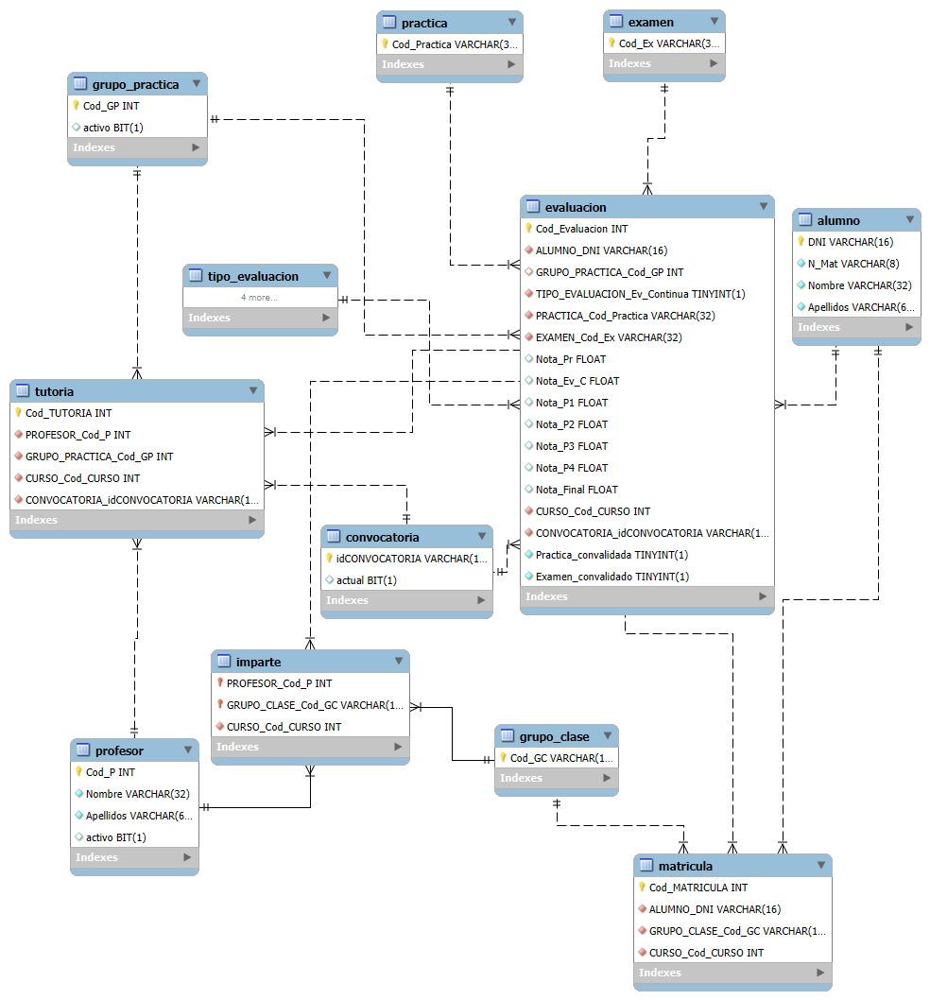
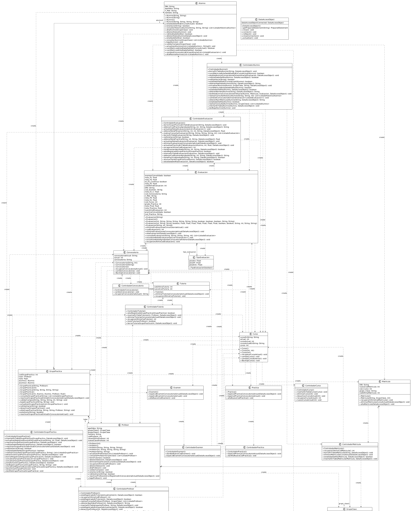
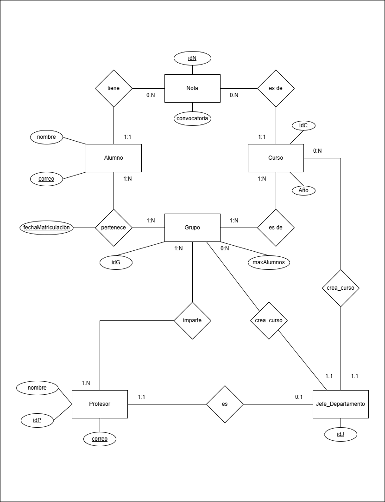

# Plan de Migración

## 1. Introducción

A continuación, se definirá el plan de migración que el equipo X cree necesario seguir para migrar el sistema legado al nuevo sistema. Se seguirán los 13 pasos de planificación para lograrlo, aunque solo se explicarán algunos de ellos (los resaltados en **negrita**):

1. **Paso 1: Realizar análisis de portfolio.**
2. **Paso 2: Identificación de las partes interesadas.**
3. **Paso 3: Comprensión y definición de los requisitos de migración.**
4. **Paso 4: Creación de un caso de negocio.**
5. **Paso 5: Decisión de ir o no ir.**
6. **Paso 6: Comprensión del Sistema legado.**
7. **Paso 7: Comprensión de la tecnología objetivo.**
8. **Paso 8: Evaluación de las tecnologías disponibles.**
9. **Paso 9: Definición de la arquitectura objetivo.**
10. **Paso 10: Definición de la estrategia de migración.**
11. **Paso 11: Reconciliar la estrategia con las necesidades de las interesadas.**
12. **Paso 12: Determinar los recursos requeridos.**
13. **Paso 13: Evaluar la plausibilidad de la estrategia.**

---

## 2. Comprensión y definición de los requisitos de migración

- **Funcionalidad principal:**  
  El sistema se presenta como un sistema de gestión académica. Entre sus funcionalidades destacan las operaciones sobre los alumnos:
    - Asignación de grupos y cursos.
    - Gestión y registro de notas.
    - Creación de cursos y grupos.
    - Asignación de profesores a grupos.

- **Sistema Crítico:**  
  La migración de datos puede implicar que el sistema sea inaccesible por un tiempo, lo cual incumple las restricciones impuestas por la empresa (ETSISI). Por ello, se debe tener mucha cautela.

- **Prácticas de Reingeniería:**  
  Se seguirán tres procesos:
    - **Ingeniería inversa:** Obtención de los requisitos y funcionalidades principales del sistema, descartando aquellas innecesarias.
    - **Cambios:** Realización de modificaciones a lo largo de las fases (requisitos, análisis, diseño e implementación) para cumplir con las nuevas necesidades.
    - **Ingeniería directa:** Construcción del sistema aplicando los cambios requeridos.

---

## 3. Comprensión del sistema legado

- **Objetivo:**  
  El sistema actual gestiona la parte académica de la ETSISI, principalmente enfocado en la administración de alumnos y sus notas.

- **Estructura estática:**  
  El sistema se compone de múltiples entidades, entre las cuales destacan:
    - **Alumnos**
    - **Profesores**
    - **Jefe de departamento**
    - **Notas**

  Aunque se sigue el patrón de diseño MVC, se observan fallas que se evidencian en inconsistencias entre la base de datos y la aplicación Java. (ver [repositorio en GitHub](https://github.com/ManuMedina1/reingenieria-ems-IWM31-G5-2025.git)).

  En general se ven muchas inconsistencias entre **la base de datos y la aplicación JAVA**, todas ellas expuestas a detalle en el [repositorio git](https://github.com/ManuMedina1/reingenieria-ems-IWM31-G5-2025.git) ya mencionado, aunque destacamos principalmente la falta de entidades en la aplicación, que aparecen en la base de datos, pero no en el sistema.  

  
  

- **Estructura dinámica:**  
  El comportamiento del sistema incluye acciones como:
    - Cambio de notas de los alumnos.
    - Creación de grupos o cursos.
    - Asignación de profesores a los grupos.

  Se cuenta además con un diagrama de secuencia que ilustra estas interacciones.

  

- **Dependencias:**  
  Existen muchas dependencias que complican el mantenimiento o la actualización del sistema, lo que sugiere la necesidad de refactorizar el código para asegurar que se cumplan los requisitos esenciales.

  

---

## 4. Comprensión de la tecnología objetivo

Se disponen de las siguientes tecnologías:

- **Control de versiones:**  
  Permite gestionar la evolución del sistema mediante el guardado y el control de versiones del código fuente.

- **Técnicas de CI/CD:**  
  Automatización de integraciones, ejecución de pruebas unitarias y despliegue continuo, lo que garantiza el cumplimiento de los requisitos en cada mejora.

- **Mockups y prototipos:**  
  Esqueletos funcionales que simulan partes del sistema para probar sus funcionalidades de forma anticipada.

- **Componente ETL:**  
  Herramientas y técnicas para extraer, transformar y cargar datos desde diferentes fuentes hacia el nuevo sistema.

- **Gateway de sincronización:**  
  Mecanismo que permitirá sincronizar los datos del sistema legado con el nuevo sistema durante la migración.

---

## 5. Definición de la arquitectura objetivo

Después de un arduo análisis, se pudo identificar las principales funcionalidades del sistema que se querrán en el nuevo sistema (ver [repositorio git](https://github.com/ManuMedina1/reingenieria-ems-IWM31-G5-2025.git)). Por lo cual, se diseñaron los nuevos modelos de base de datos (modelo E-R) y del sistema (diagrama de clases):

- Estos modelos se obtuvieron a partir de la entrevista con un profesor, por lo cual solo consideramos estas necesidades.
- Se mantendrá el uso del patrón MVC, pero esta vez respetando sus principios.
- Por último, se considerará hacer la debida refactorización del código, con el fin de evitar los incómodos y fastidiosos code smells. Se procederá a la refactorización del código para evitar los inconvenientes (code smells) observados anteriormente.

**Relaciones de los Diagramas:**

- Un alumno se matricula en uno o varios grupos, registrándose la fecha de matriculación.
- Un grupo pertenece a uno o varios cursos y viceversa (por ejemplo, el grupo IWM31 puede pertenecer a los cursos 2024 y 2025, variando los alumnos matriculados).
- Un alumno tiene 0 (si no se ha calificado) o muchas notas; cada nota corresponde a un solo alumno.
- Una nota es asignada a un solo curso, mientras que un curso puede tener múltiples notas (o ninguna, si aún no se han asignado).
- Un profesor imparte clases a uno o varios grupos, y un grupo puede ser impartido por uno o varios profesores.
- Un profesor puede ser o no jefe de departamento; en cambio, un jefe de departamento es siempre un profesor.
- Un jefe de departamento crea 0 o N grupos, mientras que un grupo solo es creado por un jefe de departamento.
- Pasa lo mismo para la creación de cursos (crear 0 o N grupos, es creado por 1 jefe).
- Estas relaciones pueden ser controladas tanto en la base de datos como en la aplicación a través de funciones CRUD.
- Estas dos últimas relaciones se podrían eliminar y controlarlas en el sistema, pero decidimos mantenerlas para saber qué jefe realiza estas acciones.
- En el diagrama de clases, las funciones de cada clase se relacionan con las acciones CRUD requeridas (obtener alumnos por parte de los profesores, asignar profesores a grupos, crear grupos o cursos, etc.).
---

## 6. Definición de la estrategia de migración

### a) Plan de migración - Análisis

- **Metodología Chicken Little:**
    - Se opta por mantener el sistema legado activo durante todo el proceso de migración.
    - El sistema solo se desactivará una vez que el nuevo sistema esté completamente operativo y se hayan migrado todos los datos de forma íntegra.
    - Se llevará a cabo la migración de manera incremental, permitiendo la validación temprana de cada fase.
    - Este enfoque iterativo facilita la retroalimentación constante de los usuarios (profesores), permitiendo ajustes y mejoras durante el proceso.

### b) Proceso de migración

Tal como se ha mencionado anteriormente, el plan de migración se llevará a cabo de forma incremental, dividiéndose en distintas etapas. A continuación, se presenta un esquema detallado de cada fase, incluyendo:

- Los componentes que se desarrollarán en cada etapa. 
- Las tablas implicadas y los datos que deberán migrar progresivamente. 
- El objetivo funcional que permitirá poner en marcha la funcionalidad desarrollada en cada fase y dejarla disponible para su validación por parte del profesorado. 
- La descripción del mockup que se mostrará a los profesores como referencia visual del avance.

### c) Iteraciones del plan de migración:

#### Iteración 1

- **Funcionalidades:**
    - Implementación de la pantalla de login.
    - Autenticación a través del sistema SSO del CIC, sin que la aplicación almacene las credenciales.
    - Asignación de roles a los usuarios y control de acceso en función de estos.
- **Tablas a migrar:**
    - Alumno
    - Profesor
    - Jefe de Departamento
- **Datos:**
    - Simulación facilitada por el CIC que incluye correos electrónicos y roles.
- **Validación:**
    - Acceso correcto al sistema y presentación de una interfaz básica según el rol del usuario.

#### Iteración 2

- **Funcionalidades:**
    - Habilitación de la creación y gestión de cursos académicos y grupos de clase.
    - Gestión de altas, modificaciones y consultas de cursos y grupos.
    - Asignación de profesores a grupos.
- **Tablas a migrar:**
    - Curso
    - Grupo
- **Datos:**
    - Simulación de cursos académicos con sus grupos asociados, abarcando varios ciclos.
- **Mockup:**
    - Listado de cursos tras el inicio de sesión; formulario para creación/edición de cursos accesible al jefe de departamento y visualización para el resto de los usuarios.
- **Validación:**
    - Verificar la creación y edición de cursos y grupos, control de nombres duplicados y coherencia en las fechas.

#### Iteración 3

- **Funcionalidades:**
    - Matriculación y rematriculación de alumnos en los grupos de clase.
    - Carga inicial de alumnos y profesores a partir de datos del CIC.
- **Tabla a migrar:**
    - Relación N:N entre Alumno y Grupo (ya que ambos ya se encuentran migrados).
- **Datos:**
    - Simulación de alumnos ficticios y su asignación a grupos, mediante un script.
- **Mockup:**
    - Listado de grupos donde se incluye la opción "Matricular nuevo alumno" a través de un formulario.
- **Validación:**
    - No permitir que un alumno esté matriculado en más de un grupo de la misma asignatura.
    - No permitir matricular en un grupo que haya alcanzado su capacidad máxima.
    - Registro correcto de la fecha de matriculación.

#### Iteración 4

- **Funcionalidades:**
    - Gestión de calificaciones para dos convocatorias por curso.
    - Asignación y modificación de notas.
    - Consulta de calificaciones mediante búsqueda con el correo electrónico del alumno.
- **Tablas a migrar:**
    - Notas
    - Relaciones entre Notas, Alumnos y Cursos.
- **Datos:**
    - Simulación de evaluaciones con notas aleatorias distribuidas en los distintos cursos y convocatorias.
- **Mockup:**
    - Pantalla de consulta con un botón "Asignar nota" y opción para modificar evaluaciones previas.
- **Validación:**
    - No permitir más de una nota por convocatoria para el mismo curso.
    - Permitir sobrescribir notas de convocatorias anteriores.
    - Garantizar que la asignación de nota respete los formatos y mantenga la consistencia de los datos.

#### Iteración 5

- **Funcionalidades:**
    - Visualización del historial académico de calificaciones para los alumnos.
- **Características:**
    - Listado de calificaciones clasificado por año académico.
    - Visualización de los grupos en los que el alumno ha estado matriculado a lo largo de su trayectoria.
- **Datos:**
    - Simulación del historial de un alumno en tres cursos académicos anteriores.
- **Mockup:**
    - Pantalla "Mis Cursos" que muestra el listado de años y, al seleccionar uno, se detalla el grupo y las notas correspondientes.
- **Validación:**
    - Confirmar que cada alumno accede de forma segura y correcta a su historial.

#### Iteración 6 (Final)

- **Funcionalidades:**
    - Integración completa de todas las funcionalidades desarrolladas en iteraciones anteriores.
    - Ejecución de pruebas de aceptación finales con datos reales.
    - Corrección de errores menores detectados durante las fases anteriores.
- **Proceso:**
    - Migración final de los datos reales del sistema legado mediante scripts y procesos ETL.
    - Una vez validado el correcto funcionamiento del nuevo sistema y completados los flujos de trabajo, se desactivará el sistema legado.

### d) Componentes adicionales requeridos

- **ETL (Extract, Transform, Load):**
    - **Entradas:** Ficheros SQL extraídos de la base de datos del sistema legado.
    - **Funciones principales:**
        - Adaptar la estructura de datos antigua para ser compatible con el nuevo sistema.
        - Anonimizar los datos utilizados en pruebas, garantizando el cumplimiento del Reglamento General de Protección de Datos.
    - **Salidas:**
        - Carga de la estructura y datos transformados en la nueva base de datos.

- **Gateway de sincronización temporal:**
    - Sincronizar o redirigir los datos entre el sistema legado y el nuevo sistema durante la migración.
    - Coordinar el flujo de datos y asegurar la continuidad del servicio durante el proceso.

- **Control de versiones, Integración continua y Despliegue continuo (CI/CD):**

    - **Control de versiones:**
        - Uso de Git, con un repositorio central en GitHub.
        - Estrategia de ramas:
            - **Main:** Versión estable lista para producción.
            - **Dev:** Rama de desarrollo donde se integran funcionalidades en curso.
            - **Feature:** Ramas específicas para cada iteración del plan de migración.
            - **Hotfix:** Correcciones urgentes aplicadas directamente a la rama Main.

    - **Integración continua (CI):**
        - Implementación de un pipeline automatizado mediante GitHub Actions.
        - Tareas: compilación, ejecución de pruebas unitarias e integración, y validación de reglas de negocio (por ejemplo, restricciones de roles y consistencia en matrículas y evaluaciones).

    - **Despliegue continuo (CD):**
        - Cada iteración se desplegará automáticamente en un entorno simulado mediante contenedores Docker.
        - Los usuarios finales (profesores) podrán probar las funcionalidades y proveer feedback, facilitando la detección temprana de errores.

---

## 7. Conclusiones finales

- **Complejidad elevada:**  
  El sistema legado posee numerosas dependencias y relaciones complejas que hacen de su migración un reto importante. Cualquier error o cambio no controlado podría comprometer la integridad de los datos y el funcionamiento general del sistema.

- **Necesidad de seguir el plan rigurosamente:**  
  Dada la criticidad del sistema, es esencial adherirse a cada uno de los pasos del plan de migración para evitar la pérdida de información vital. La estrategia incremental y la validación constante en cada iteración son claves para mitigar riesgos.

- **Importante cantidad de trabajo:**  
  La migración no solo implica trasladar datos, sino también refactorizar el código, actualizar la arquitectura y adaptar tecnologías modernas (CI/CD y ETL). Todo ello requiere un esfuerzo coordinado y una planificación meticulosa para garantizar una transición exitosa sin interrupciones en el servicio.

---

Este documento representa el plan de migración propuesto para transformar el sistema legado en uno moderno, manteniendo la continuidad operativa y asegurando la integridad de los datos a lo largo del proceso.
